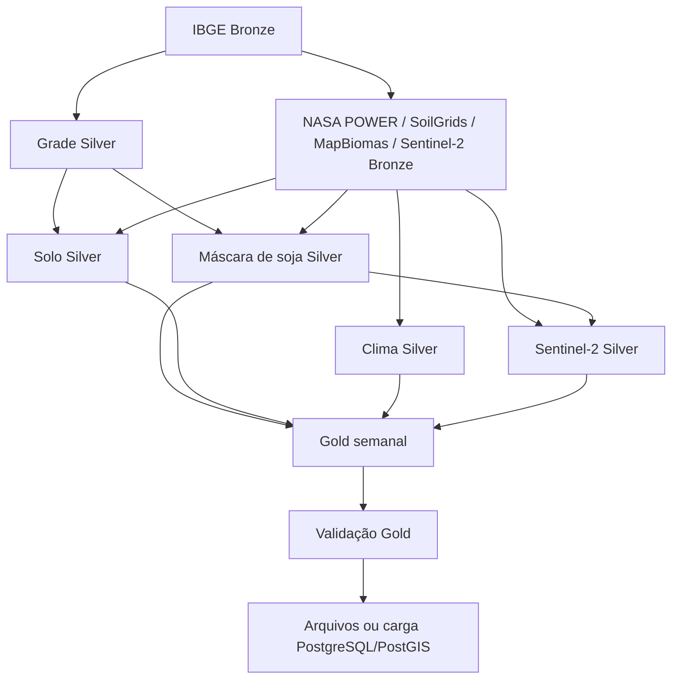

# Orquestração local com Airflow

O Airflow coordena os CLIs existentes; ingestão, transformação e regras do score permanecem
no pacote `water_stress`. O DAG `water_stress_pipeline` executa o período inteiro de
`configs/project.yml`. A data do disparo não altera as datas da safra.

A instalação local usa Docker Compose, Airflow 3.2.2 com Python 3.12 e `LocalExecutor`.
`airflow standalone` inicializa o banco e inicia os componentes no mesmo container.
Um PostgreSQL separado guarda exclusivamente os metadados do Airflow; ele não é o PostGIS
com as tabelas Bronze/Silver/Gold. As dependências geoespaciais ficam em um virtualenv separado,
instalado com `uv.lock`, para evitar conflitos com as dependências do Airflow.

Referências oficiais: [Quick Start](https://airflow.apache.org/docs/apache-airflow/stable/start.html),
[Docker Compose](https://airflow.apache.org/docs/apache-airflow/3.2.2/howto/docker-compose/),
[BashOperator](https://airflow.apache.org/docs/apache-airflow-providers-standard/stable/operators/bash.html).
Esse ambiente é destinado à execução local. Para processamento estadual, reserve pelo menos
8 GB no Docker Desktop e ajuste conforme o consumo observado dos rasters e da carga relacional.

## Modos de execução

| Parâmetro `mode` | Operações | Pré-requisitos |
|---|---|---|
| `gold-only` (padrão) | Gold → validação → publicação opcional | Silver já processada |
| `satellite-gold` | Sentinel-2 Silver → Gold → validação → publicação opcional | Catálogo Bronze, grade, máscara, solo e clima Silver |
| `full` | Bronze → Silver → Gold → validação → publicação opcional | Acesso às fontes externas |

`load_database=false` publica somente os arquivos. Com `true`, executa migrations, registra
manifestos Bronze e carrega todas as tabelas Silver/Gold em ordem de dependência. Isso requer
PostgreSQL/PostGIS configurado e habilitado em `.env`, e disponibilidade de todos os datasets Silver.
A carga atual materializa tabelas em memória; considere esse custo ao reservar RAM.

O processamento completo respeita estas dependências:



O DAG começa pausado, sem agendamento (`schedule=None`) e sem catchup. Uma execução e uma tarefa
por vez evitam escrita simultânea nos mesmos arquivos locais. A paralelização interna Sentinel-2
continua limitada pela configuração do projeto. Não execute os CLIs manualmente sobre o mesmo
`data/` enquanto houver tarefas Airflow em execução.

## Primeiro início

Execute os comandos na raiz do repositório:

1. Inicie o Docker Desktop.
2. Prepare as variáveis locais sem sobrescrever o `.env` existente:

   ```bash
   cp deployment/airflow/airflow.env.example .env.airflow
   ```

   Edite `.env.airflow`: preencha `AIRFLOW_METADATA_PASSWORD` com uma senha local forte composta
   de letras e números (ela é usada na URI de conexão). `AIRFLOW_PIPELINE_DATABASE_HOST` aponta
   para o PostGIS existente; no Docker Desktop, mantenha `host.docker.internal` para alcançar
   o servidor da máquina. Não use `localhost` para esse servidor dentro do container.
   `.env.airflow` e `.env` são ignorados pelo Git. O Compose lê as variáveis do pipeline de `.env`
   e sobrescreve somente o host do banco para uso no container.
3. Valide, construa e inicie:

   ```bash
   docker compose --env-file .env.airflow -f compose.airflow.yml config --quiet
   docker compose --env-file .env.airflow -f compose.airflow.yml build
   docker compose --env-file .env.airflow -f compose.airflow.yml up -d
   docker compose --env-file .env.airflow -f compose.airflow.yml ps
   ```

4. Confira o carregamento do DAG:

   ```bash
   docker compose --env-file .env.airflow -f compose.airflow.yml exec airflow airflow dags list-import-errors
   docker compose --env-file .env.airflow -f compose.airflow.yml exec airflow airflow dags list
   ```

5. Acesse `http://localhost:8080`. O usuário é `admin`; a senha é gerada automaticamente.
   Para consultá-la **somente no seu terminal local**:

   ```bash
   docker compose --env-file .env.airflow -f compose.airflow.yml exec airflow cat /opt/airflow/simple_auth_manager_passwords.json.generated
   ```

6. Despause `water_stress_pipeline` na interface e use **Trigger DAG**, escolhendo `mode` e
   `load_database`. Para os dados já existentes, comece com `gold-only`, publicação desabilitada.
   Depois, execute com publicação habilitada se desejar atualizar o PostGIS.

Também é possível disparar pela CLI:

```bash
# Ative uma vez, para permitir que o scheduler execute os disparos manuais.
docker compose --env-file .env.airflow -f compose.airflow.yml exec airflow airflow dags unpause water_stress_pipeline

docker compose --env-file .env.airflow -f compose.airflow.yml exec airflow airflow dags trigger water_stress_pipeline --conf '{"mode":"gold-only","load_database":false}'
```

As configurações e migrations são montadas somente para leitura; `data/` é compartilhado com
os arquivos locais. Logs, autenticação e metadados ficam em volumes Docker persistentes.
Alterações em `src/`, dependências ou Dockerfile exigem novo `build` e recriação do container.
Mudanças em `dags/` e `configs/` são vistas pelos serviços pelos mounts.

## Falhas e retomada

- Falha em uma etapa bloqueia as etapas dependentes. As tarefas ignoradas por um modo são `skipped`.
- `validate_gold` bloqueia relatório ausente, inválido, `failed` ou Gold vazia. `warning` permite
  publicação, pois atributos opcionais ausentes são parte do contrato; não equivale a score completo.
- Tarefas não têm retry automático geral: erro de contrato não deve ser repetido. Requisições HTTP
  usam a política limitada de timeout, retry transitório e backoff já existente no pipeline.
- Após corrigir a causa, use **Clear** nas tarefas com falha e nas dependentes dentro da mesma execução.
  O Airflow mantém as etapas bem-sucedidas; os CLIs reutilizam artefatos conforme suas políticas
  existentes. Silver não possui checkpoint universal; uma transformação retomada pode ser refeita.
- Gold reutiliza partições com a mesma assinatura e checksum; Bronze nunca recebe `--force` pelo DAG.
- A carga relacional é transacional por dataset, não por pipeline inteiro. Se uma tabela falhar,
  outras tabelas já carregadas podem permanecer atualizadas; um novo disparo repete upserts seguros.

```bash
# Diagnóstico de serviços; logs por tarefa também estão disponíveis na interface.
docker compose --env-file .env.airflow -f compose.airflow.yml logs --tail 100 airflow

# Encerrar preservando dados e histórico.
docker compose --env-file .env.airflow -f compose.airflow.yml down
```

## Validação e evolução

A suíte padrão valida o gate de qualidade sem instalar Airflow ou acessar rede. Os testes específicos
do DAG exigem um ambiente com Airflow 3.2.2, provider standard e pytest:

```bash
python -m pytest tests/airflow --confcutdir=tests/airflow -o addopts=''
```

Eles verificam modos, dependências, serialização e ordem de publicação usando as classes reais do
Airflow. O build e a inicialização em Docker devem ser conferidos antes do primeiro processamento.

Para agendamento recorrente, primeiro defina como avançar o período do estudo e atualizar o catálogo
Bronze. Apenas adicionar um cron repetiria a mesma safra histórica e reutilizaria suas requisições.
Executores distribuídos também precisam de armazenamento compartilhado ou object storage; montar
`data/` em um único host não atende workers em máquinas diferentes.
